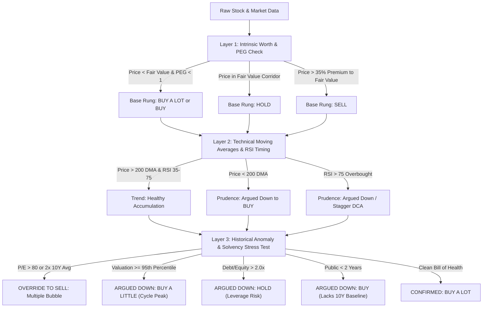

# AlphaConstraint: AI Infrastructure & 5-Rung Valuation Intelligence Engine

[](LICENSE)
[](https://react.dev/)
[](https://python.org)
[](https://vitejs.dev/)
[](https://tailwindcss.com/)
[](https://github.com/ranaroussi/yfinance)

> **"Find the physical constraint, because the constraint decides who gets paid."**  
> An institutional-grade equity valuation engine and physical infrastructure bottleneck screener combining multi-layer fundamental models, technical momentum filters, and balance sheet solvency stress tests.

---

## Table of Contents
- [1. Macro Context & The Physical Bottleneck Thesis](#1-macro-context--the-physical-bottleneck-thesis)
- [2. The 3-Layer Algorithmic Engine & 5 Signal Rungs](#2-the-3-layer-algorithmic-engine--5-signal-rungs)
- [3. The 6 Institutional Quant Enhancements](#3-the-6-institutional-quant-enhancements)
- [4. Platform Features](#4-platform-features)
- [5. System Architecture](#5-system-architecture)
- [6. Quick Start Guide](#6-quick-start-guide)
- [7. Terminal CLI Usage](#7-terminal-cli-usage)
- [8. Security & Zero-Leak Verification](#8-security--zero-leak-verification)
- [9. Disclaimer](#9-disclaimer)

---

## 1. Macro Context & The Physical Bottleneck Thesis

While financial media frequently speculates about an "AI bubble," physical infrastructure data reveals a contradictory reality:

1. **The $1.7 Trillion Contract Backlog:**  
   Microsoft, Amazon, and Google Cloud hold nearly **$1.7 Trillion** in non-cancellable enterprise customer commitments. This revenue cannot be realized until physical servers, power substations, and cooling loops are turned on.
2. **The Thermal & Power Wall:**  
   A single rack of Nvidia NVL72 (Blackwell) draws **140 kW**—more than 20 legacy A100 server racks combined. It physically requires direct subfloor liquid cooling. **Fewer than 4% of American data centers can physically host one**.
3. **The 4.2-Year Grid Interconnect Queue:**  
   Obtaining high-voltage power transmission interconnects in primary data center hubs averages **4.2 years**. As a result, older computing chips (such as A100s) remain contracted into 2029 at premium rates.
4. **The Physical Commodity Constraint (Copper):**  
   Every gigawatt of data center power capacity requires ~40,000 metric tons of refined electrical-grade copper busbars, transformers, and radiator cooling fins.

---

## 2. The 3-Layer Algorithmic Engine & 5 Signal Rungs

AlphaConstraint evaluates every asset through a 3-Layer algorithmic system where the model **"argues with itself"** to prevent emotional FOMO or cyclical bag-holding:



### The 5 Signal Rungs:
- 🟢 **BUY A LOT:** High-conviction accumulation. Confirmed margin of safety, trading above 200 DMA, zero multiple anomalies, fortress balance sheet.
- 🟩 **BUY:** Solid fundamental value. Position sizing kept moderate due to minor technical momentum pullbacks or short public history.
- 🟡 **BUY A LITTLE:** Cyclical valuation warning. Stock sits in top historical multiple bands or RSI is overbought. Restrict to dollar-cost averaging (DCA).
- ⚪ **HOLD:** Balanced risk/reward, elevated debt load, or awaiting order backlog conversion.
- 🔴 **SELL / SELL SOME:** Valuation bubble. Price has outpaced business reality (>2x historical normal P/E).

---

## 3. The 6 Institutional Quant Enhancements

To prevent buying local tops or speculative capital traps, the engine integrates 6 institutional quantitative metrics:

| Metric | Mechanism & Threshold | Tactical Signal Action |
| :--- | :--- | :--- |
| **1. 14-Day RSI Momentum** | Wilder's exponential smoothing on 3-month daily closes. | **RSI > 75:** Overbought alert; pulls down entry sizing to stagger DCA.<br>**RSI < 35:** Deep oversold capitulation; prime accumulation window. |
| **2. FCF Yield & Peter Lynch** | `(Free Cash Flow / Market Cap) * 100` and `EPS * Growth Rate`. | Identifies organic cash generators (>3% yield) vs. continuous diluters. |
| **3. Solvency & Debt-to-Equity** | Normalized D/E ratio and Net Cash/Debt runway test. | **D/E > 2.0x:** Solvency warning; downscales signal to protect capital. |
| **4. Indian Governance & ROCE** | Promoter Pledging % and Capital Efficiency (>18% ROCE). | Verifies unencumbered promoter holdings and capital return quality. |
| **5. Physical Moat Score (1-10)** | Classifies bottleneck severity (Grid, Cooling, Copper, Optics). | **10/10:** Power Grid & Transformers (4.2y lead time).<br>**9/10:** Direct Liquid Cooling (140 kW/rack). |
| **6. Stop Cut & Allocation Cap** | 200 DMA break (-2%) or 15% stop loss + Market Cap sizing. | Sizing caps: Mega (10%), Large (6%), Mid/Small (3.5%), Micro (1.5%). |

---

## 4. Platform Features

- **⚡ Universal Plain-Name Search:** Search any global or Indian company (e.g. `Reliance`, `TARIL`, `Modine`, `Tata Motors`, `Nvidia`, `Zomato`) without needing exact ticker suffixes.
- **🇮🇳 Full Indian Market Support:** Live quotes for NSE (`.NS`) and BSE (`.BO`) with Indian Rupee (`₹`) notation, Crores (`Cr`), and Lakh Crores (`Lakh Cr`).
- **🗺️ Physical Constraint Map:** Interactive data center internal topology (Compute, Memory, Optics, Inference) mapped to physical bottlenecks.
- **🎲 20 Million Calculations Nightly Monte Carlo Simulator:** Live simulation engine with real-time shock sliders for Hyperscaler Backlog cuts (-50% to +50%) and Grid Delays (0 to 36 months).
- **🧪 Interactive Custom Valuation & Quant Lab:** Adjust Fair Value, P/E, 200 DMA, 14-Day RSI, and D/E sliders to observe real-time algorithmic verdict recalculations.
- **❄️ Data Center Engineering Physics Calculator:** Compute megawatt electrical load, closed-loop cooling GPM, and required copper tonnage for any cluster size.
- **💰 Dollar-Cost Averaging (DCA) Allocator:** Automatically distributes monthly investment capital strictly according to the 5-rung risk-weighting framework.

---

## 5. System Architecture

```text
┌─────────────────────────────────────────────────────────┐
│              Browser Client (Port 5173)                 │
│    React 19 • Vite • Tailwind CSS • Lucide Icons        │
└────────────────────────────┬────────────────────────────┘
                             │ Proxied /api/stock requests
                             ▼
┌─────────────────────────────────────────────────────────┐
│            Python API Server (Port 5001)                │
│    yfinance • pandas (Wilder's RSI) • numpy             │
│    - Indian Alias Resolver & Search Priority            │
│    - 3-Layer Valuation Model                            │
│    - 6-Factor Institutional Quant Engine                │
└────────────────────────────┬────────────────────────────┘
                             │
                             ▼
                 Yahoo Finance Real-time Feed
```

---

## 6. Quick Start Guide

### Prerequisites
- **Node.js** (v18 or higher)
- **Python** (v3.9 or higher)

### Installation

1. **Clone the repository:**
   ```bash
   git clone https://github.com/amnkur/ai-infrastructure-valuation.git
   cd ai-infrastructure-valuation
   ```

2. **Install Python dependencies:**
   ```bash
   pip install -r requirements.txt
   ```

3. **Install Frontend dependencies:**
   ```bash
   cd ai-infra-valuation-app
   npm install
   cd ..
   ```

### Running the Application

#### Option A: One-Click Launcher (Windows)
Double-click **`start_app.bat`**. This starts both the Python API server (port 5001) and Vite frontend (port 5173), then opens the application in your browser.

#### Option B: One-Click Launcher (macOS / Linux)
```bash
chmod +x start_app.sh
./start_app.sh
```

#### Option C: Manual Launch
**Terminal 1 (Backend):**
```bash
python api_server.py
```

**Terminal 2 (Frontend):**
```bash
cd ai-infra-valuation-app
npm run dev
```
Open **`http://localhost:5173/`** in your browser.

---

## 7. Terminal CLI Usage

You can evaluate any stock directly from your terminal using `check_stock.py`:

```bash
# Evaluate Indian Power Transformer Bottleneck (TARIL)
python check_stock.py TARIL

# Evaluate US Data Center Liquid Cooling Bottleneck (Modine)
python check_stock.py Modine

# Evaluate AI Semiconductor Platform (Nvidia)
python check_stock.py NVDA
```

### Sample CLI Output:
```text
=================================================================
  QUANTITATIVE 3-LAYER VALUATION & AUDIT ENGINE: TARIL
=================================================================
[*] Fetching live market & quant data via yfinance...
[Alias Match] 'TARIL' -> TARIL.NS

[+] Company:              TRANS & RECTI. LTD (TARIL.NS)
[+] Market / Exchange:    NSE (India) • Electrical Equipme
[+] Current Price:        ₹270.45
[+] Model Fair Value:     ₹344.33
[+] Peter Lynch FV:       ₹88.80
[+] 200-Day Moving Avg:   ₹298.20 (BELOW)
[+] P/E Multiple:         30.5x (10Y avg: 22.8x)
[+] PEG Ratio:            1.00
[+] Operating Margin:     15.1%

--- 6 INSTITUTIONAL QUANT ENHANCEMENTS ---
[1] 14-Day RSI Momentum:  33.3 (Oversold (33.3) - Capitulation Value Zone)
[2] Free Cash Flow:       ₹220 Cr (FCF Yield: 2.71%)
[3] Balance Sheet Health: Fortress (Net Cash / Low Debt) (D/E: 0.3x)
[4] Capital Return / ROE: ROCE 13.6% | 0.0% Pledged • High Institutional Trust
[5] Physical Moat Score:  10 / 10 (Power Grid & Transformer Bottleneck)
    -> Moat Detail:       4.2-year utility wait time backlog. Impossible to energize 100MW+ AI clusters without high-voltage step-up transformers.
[6] Risk Management:      Stop Cut: ₹229.88 | Max Alloc: 3.5% (Mid/Small Cap Multi-bagger)

-----------------------------------------------------------------
  OFFICIAL VERDICT:       >>> BUY <<<
  [!] THE MODEL ARGUED DOWN: Momentum sliding: Price is currently below 200 DMA (₹298.20).
-----------------------------------------------------------------
```

---

## 8. Security & Zero-Leak Verification

- **No Hardcoded API Keys or Secrets:** Real-time data is fetched via public financial feeds.
- **Zero Telemetry or Data Collection:** All simulations and calculations execute locally on your machine.
- **Clean Git Tracking:** Root `.gitignore` prevents `node_modules`, build artifacts (`dist/`), virtual environments, and `.env` files from ever entering source control.

---

## 9. Disclaimer

*This application is an educational, research, and algorithmic analysis tool based on publicly discussed financial modeling principles. It is NOT financial advice, an endorsement, or a recommendation to buy or sell any security. Financial markets involve risk of loss. Always conduct independent due diligence.*

---

## License

This project is licensed under the MIT License — see the [LICENSE](LICENSE) file for details.
